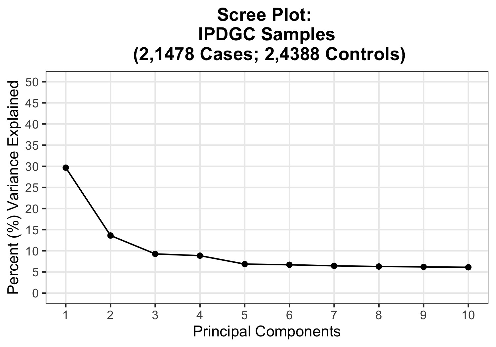
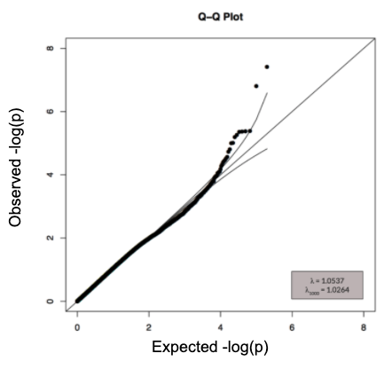
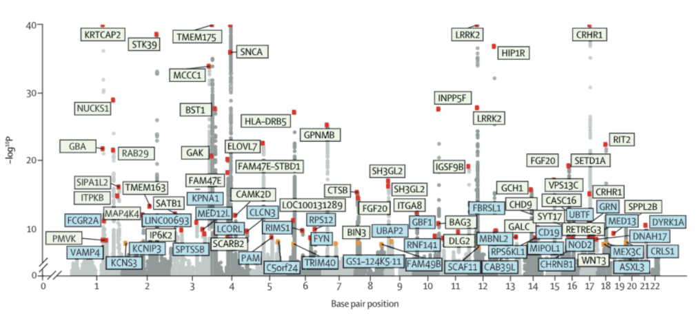

## Module III.  GWAS for Binary and Quantitative Traits 

### Information
- **Created by:** GP2 Training and Networking

## Table of Contents

#### [0. Getting Started](#0)

#### [1. Generation of a Covariates File](#1)

#### [2. Running a GWAS in PLINK](#2)

#### [3. Generating Summary Statistics](#3)

#### [4. Data Visualization: Scree Plot](#4)

#### [5. Data Visualization: QQ Plot](#5)

#### [6. Data Visualization: Manhattan Plot](#6)

#### [7. Prep for FUMA GWAS](#7)

#### [8. Logistic versus Linear Regressions](#8)

---
<a id="0"></a>
## 0. Getting Started
Files that you will need:
- **QC’d Pre-Imputation PLINK Binary Files** containing cases and controls (.fam, .bim, .bed files)
	- These have gone through the quality control (QC) steps outlined in Module I

-   **QC’d Imputed PLINK Binary Files** containing cases and controls (.fam, .bim, .bed files)
	-   These have gone through Michigan Server imputation and the soft/hard-call QC steps outlined in Module II
   
-   **Covariates File** containing the covariates you would like to correct by (more on this in section 1)
	-  	This file at a minimum includes sample information (such as ID, SEX, PHENO) and principle components

This tutorial is written in R, and these are the packages you will need to install/load 
```R
# Download the necessary packages 
if (!require(tidyverse)) install.packages('tidyverse')
if (!require(data.table)) install.packages('data.table')
if (!require(dplyr)) install.packages('dplyr')
if (!require(plyr)) install.packages('plyr')
if (!require(ggplot2)) install.packages('ggplot2')
if (!require(qqman)) install.packages('qqman')

# Load the necessary packages 
library(tidyverse)
library(data.table)
library(dplyr)
library(plyr)
library(ggplot2)
library(qqman)
```
Other programs you will need are:
 - **PLINK v1.9** @ https://www.cog-genomics.org/plink/1.9/
 - **RVTests [OPTIONAL]** @ http://zhanxw.github.io/rvtests/
 - **R** @ https://www.r-project.org/


---
<a id="1"></a>
## 1. Generation of a Covariates File

### Background Information
-   What is a covariate file?
	-   A covariate file is a file that includes the sample information, principal components, and other information you would like to correct for
-   Why do we need it for a GWAS?
	-   Adding covariates is beneficial because non-confounding covariates can explain some of the variance → reducing noise
- What is included in a covariates file?
	- This file at a minimum includes sample information (such as ID, SEX, PHENO) and principle components
	- If you have additional covariates you'd like to use (such as AGE, FAMILY HISTORY, EDUCATION etc.) you can merge these into the covariate file 
- How do you generate the PCs?
	- This is done in PLINK

### Generating Principal Components in PLINK
```bash
# Make sure to use high-quality SNPs 
plink --bfile EXAMPLE_UNIMPUTED_QC --maf 0.01 --geno 0.05 --hwe 1E-6 --make-bed --out EXAMPLE_UNIMPUTED

# Prune out unnecessary SNPs (only need to do this to generate PCs)
plink --bfile EXAMPLE_UNIMPUTED --indep-pairwise 50 5 0.5 --out prune 

# Keep only pruned SNPs (only need to do this to generate PCs)
plink --bfile EXAMPLE_UNIMPUTED --extract prune.prune.in --make-bed --out prune 

# Generate PCs 
plink --bfile prune --pca --out EXAMPLE_UNIMPUTED.PCA
```


### Generating a Covariate File in R 
```R
# Generate a covariate file 

# Read in the PCA Eigenvalues and Eigenvectors 
print("Read in pca.eigenvec file from PLINK")
eigenvec <- read.delim("EXAMPLE_UNIMPUTED.eigenvec", sep ="\t", header = T, stringsAsFactors = F)

# Read in the .fam file
fam <- fread("EXAMPLE_UNIMPUTED.fam", header = F)

# Read in other covariates 
  # RANDOM AGES AND EDUCATION LEVELS !!
  # Format
    # FID IID AGE EDUCATION ETC
additional_cov <- fread("SAMPLE_COVARIATES.txt")

# Rename the columns 
colnames(fam) <- c("FID", "IID", "PAT", "MAT", "SEX", "PHENO")

# Combine the covariate file with the fam file 
pheno_pcs <- left_join(fam, additional_cov, by=c("FID", "IID"))

# Now combine the additional covariates 
combined <- left_join(pheno_pcs, eigenvec, by=c("FID", "IID"))

# Save out the pheno_pcs file 
write.table(combined, file = "EXAMPLE_covariateFile_10PCs.txt", row.names=FALSE, na="", quote = FALSE, sep="\t")

```

Output Example :
```
FID	IID	PAT	MAT	SEX	PHENO	AGE	EDUCATION	PC1	PC2	PC3	PC4	PC5	PC6	PC7	PC8	PC9	PC10
001_10	001_10	0	0	1	1	40	2	0.00551348	-0.00146207	0.00468116	0.00435601	0.00743252	-0.00315913	-0.00430362	-0.00242458	-0.00223629	0.00381585
002_08	002_08	0	0	2	1	72	1	0.00405574	-0.000306384	-0.00226897	0.00280894	-0.00584511	-0.00364357	-0.000183857	-0.000944975
```

---
<a id="2"></a>
## 2. Running a GWAS in PLINK

### Background Information
- What is a GWAS?
	-   A GWAS is a popular method to test common genetic variants across the exomes/genotypes/genomes of many individuals to identify genotype-phenotype associations
    -   “If certain genetic variations are found to be significantly more frequent in people with the disease compared to people without disease, the variations are said to be ‘associated’ with the disease” [[Source]](https://www.genome.gov/about-genomics/fact-sheets/Genome-Wide-Association-Studies-Fact-Sheet)
-   What kind of information can we learn from this type of analysis?
    -   Loci that pass a genome-wide significance threshold for a large group of people that are more frequent in the disease phenotype than in controls

You can choose to run a GWAS in RVTests
A GWAS will only be run post-imputation and if it has been QC'd, as shown in Modules I and II.

### Running a GWAS in PLINK 
```bash
plink --bfile IMPUTED.HARDCALLS.Demo \
--logistic --ci 0.95 \
--hide-covar --covar covariateFile_forGWAS.txt \
--covar-name AGE,SEX,EDUCATION,PC1,PC2,PC3,PC4,PC5,PC6,PC7,PC8,PC9,PC10 \
--out IMPUTED.HARDCALLS.test

# The --hide-covar option removes each individual test from the output
# GWAS should only be done on imputed data after the SOFT and HARD call filters outlined in Module II
```

Output Example:
```
 CHR           SNP         BP   A1       TEST    NMISS         OR       SE      L95      U95         STAT            P
   1      1:753538     753538    A        ADD     2000      1.263    1.416  0.07868    20.28        0.165       0.8689
   1      1:754396     754396    C        ADD     2000      2.212    1.231   0.1979    24.71       0.6446       0.5192
   1      1:758591     758591    C        ADD     2000      2.212    1.231   0.1979    24.71       0.6446       0.5192
   1      1:761531     761531    A        ADD     2000      1.263    1.416  0.07868    20.28        0.165       0.8689
```

### Running a GWAS in RVTests
RVTests allows you to use VCF files, if more convenient for you:
```bash
for CHNUM in {1..22} X Y;
do
rvtest --noweb --hide-covar \
--out RVTESTS_exampleGWAS --single wald \
--inVcf /data/IMPUTATION_SERVER/chr${CHNUM}.vcf.gz \
--dosage DS \
--pheno covariateFile_forGWAS.txt \
--pheno-name PHENO \
--covar covariateFile_forGWAS.txt \
--covar-name AGE,SEX,EDUCATION,PC1,PC2,PC3,PC4,PC5,PC6,PC7,PC8,PC9,PC10 
done
```

-   What are the limitations with a GWAS?
    -   Only looks at common variants (MAF >0.05), and cannot provide information on rare variants
    - Only nominates loci and the nearest protein-coding gene (though, functionally, this might not be the causal gene)
    - Explain a number of small-effect associations
    - Literature shows that loci nominated in one population might not translate to other populations

---
<a id="3"></a>
## 3. Generating Summary Statistics

### Background Information
-   What are summary statistics? What information can be found?
	- Summary statistics have aggregate p-values and association data for every variant analyzed in a study
    -   In addition to SNP and P-value, information such as effect allele, directionality, frequency, standard error, etc. can also be found in summary statistics
 - Can summary statistics be made public?
	 - Yes! In fact, you should strive to make all your summary statistics public
    

-   Where can I find more summary statistics?
	- NHGRI-EBI have a website where they curate GWAS summary statistics, available for public download with their accompanying manuscripts at [GWAS Catalog](https://www.ebi.ac.uk/gwas/)


### Generating Summary Statistics
Summary statistics are the output of PLINK's `--logistic` or RVTests `--single wald` 


---
<a id="4"></a>
## 4. Data Visualization: Scree Plot

<p align="center">
  
</p>

Figure: Unpublished Data

### Background Information
-   What is a Scree plot?
    -   Method to visualize how much each PC individually contributes to the amount of variance we see in the data
-   Why do we do this?
	-   Good way to check that the first few PCs you will use later for your GWAS do indeed capture most of the variance we see  
	-   If you do not see this, this indicates issues in the data or the processing of the data upstream
-   How do you read a Scree plot?
	-   The percent of variance is on the Y-axis, with the number of PCs at the bottom
	-  The higher the point, the more % variance can be explained by that PC
	- Typically for a GWAS, the plateau happens at PC4 or PC5

### Making a Scree Plot in R 
```R
# Making a Scree plot 

# Read in the PCA Eigenvalues and Eigenvectors 
print("Read in pca.eigenval files from PLINK")
eigenval <- read.delim("IPDGC_all_to_include_plink2.eigenval", sep ="\t", header = F, stringsAsFactors = F)

# Update column names
colnames(eigenval)[1] <- "Eigenvalues"
eigenval$PC <- as.numeric(rownames(eigenval))
eigenval$VarianceExplained <- eigenval$Eigenvalues/sum(eigenval$Eigenvalues)*100

# Keeping only the first 10 PCs
eigenval2 <- head(eigenval,10)

# Generating the plot 
scree <- ggplot(data = eigenval2, aes(x = PC, y = VarianceExplained)) +
  geom_line() + 
  geom_point() +
  theme_bw() +
  theme(panel.grid.minor = element_blank()) + 
  scale_x_continuous(name = "Principal Components", breaks = seq(0,10,1), limits = c(NA,10)) +
  scale_y_continuous(name = "Percent (%) Variance Explained", breaks = seq(0,50,5), limits = c(0,50)) +
  ggtitle("Scree Plot: \n IPDGC Samples \n (2,1478 Cases; 2,4388 Controls)") +
  theme(plot.title = element_text(hjust = 0.5, face = "bold"))

# Saving out the plot as PDF and JPEG
ggsave("ScreePlot_IPDGC_unrelated.pdf", scree, width = 5, height = 3.5, units = "in")
ggsave("ScreePlot_IPDGC_unrelated.jpg", scree, width = 5, height = 3.5, units = "in")
```
---
<a id="5"></a>
## 5. Data Visualization: QQ Plot

<p align="center">
  
</p>

Figure: Unpublished Data

### Background Information
-   What is a QQ plot?
	-   A Q–Q (quantile-quantile) plot is a probability plot that compares two probability distributions by plotting their quantiles against each other
-   Why do we do this?
	-   “To search for evidence of systematic bias (from unrecognized population structure, analytical approach, genotyping artifacts, etc.)” [[Source](https://www.broadinstitute.org/diabetes-genetics-initiative/plotting-genome-wide-association-results)] otherwise known as the lambda (λ), or the genomic inflation factor
	-   λ scales with sample size, so also important to report the λ1000  (the inflation factor of a study of 1000 cases and 1000 controls)
	-  Visually represents the extent that the observed distribution of the test statistic follows the expected (null) distribution
- How do you read a QQ Plot?
	- The expected -log (a normal distribution) is drawn as a line, and you want to see how many of your points follow this distribution
    -   If the λ1000 is…
	    - <1 : Study is underpowered
	    - ~1: Data observed is close to expected values
	    - \>1: Study/data has inconsistencies
	- You can generate a QQ plot pre- or post-imputation
	-  Post-imputation will be closer to the normal distribution and will look better

### Generating an `.assoc` file in PLINK 
```bash
plink --bfile EXAMPLE_UNIMPUTED_QC \
--assoc --out EXAMPLE_UNIMPUTED_ASSOC

# Will generate a file with *.assoc suffix
```

### Making a QQ Plot in R [UNIMPUTED DATA]

```R
# Making a QQ Plot
  # You can make a QQ plot pre- or post- imputation
  # This script shows you how to plot it pre-imputation 
  # FUMA GWAS will generate a QQ Plot post imputation for you :) 

# Read in the .fam file
fam.file  <- fread("EXAMPLE_UNIMPUTED_QC.fam")

# Separate out the cases
case <- sum(fam.file[,6] == 2)

# Separate out the controls 
control <-  sum(fam.file[,6] == 1)

# Read in the .assoc file  
assoc.df <- fread("EXAMPLE_UNIMPUTED_ASSOC.assoc")

# Non-factorization is important
assoc.df = assoc.df[complete.cases(assoc.df), ]

# Remove any NA lines
assoc.df$CHISQ <- qchisq(assoc.df$P, 1, lower.tail=FALSE)

# qchisq(assoc.df$P,1,lower.tail=FALSE) can convert p-value (even < 5.5e-17) to chisq
    # while qchisq(1-assoc.df$P,1) fails to convert small p-value (Inf in this case) 

# Calculate lambda 
lambda <- median(assoc.df$CHISQ) / qchisq(0.5, 1)

# Calculate the lambda 1000 
lambda1000 <- 1 + (lambda - 1) * (1 / case + 1 / control) * 500
 
# qchisq(0.5,1) will give 0.4549364
# some people directly / 0.454 which may cause slightly different result
# chisq = z**2
# z <- qnorm(p-value/2)
 
# Make the QQ Plot
qqplot <- qq(assoc.df$P, main = "Q-Q plot of Pre-Imputed GWAS p-values")

# Print out the lambda statistics 
lambda1 <- paste('The lambda value is: ', lambda, sep="")
lambda10001 <- paste('The lambda 1000 value is: ', lambda1000, sep="")

# Write out the lambda statistics to an external .txt file 
lambda_stats<-file("lambda_stats.txt")
writeLines(c(paste(lambda1, lambda10001)), lambda_stats)
close(lambda_stats)

# Save the QQ Plot as PDF and JPEG
ggsave("QQPlot_UNIMPUTED.pdf", qqplot, width = 20, height = 20, units = "in")
ggsave("QQPlot_UNIMPUTED.jpg", qqplot, width = 5, height = 5, units = "in")
```

---
<a id="6"></a>
## 6. Data Visualization: Manhattan Plot

<p align="center">
  
</p>

Figure: Nalls et al., 2019

### Background Information 

-   What is a Manhattan plot?
	-   A Manhattan plot (named after the Manhattan skyline) is a type of scatter plot
-   Each point in the plot is a SNP, and the higher on the plot it is, the more “associated” that SNP is said to be with the phenotype of interest

-   Why do we do this?
	-   Manhattan plots are a visual way to present hundreds of thousands of SNPs in an easy-to-read manner
	-   The plots also have thresholds for genome-wide significance, making it easy to see how significant a SNP is
-   How do you read a Manhattan plot?
	-   Each SNP is a point, separated by chromosomes
	- The smaller the p-value → higher on the plot → more significant association
```R
## Requirements: 
    # gwasFile: A file containing GWAS summary statistics. Mandatory columns to include are SNP, CHR, BP and P
        # Format as follows:  
        # SNP	CHR	BP	P
        # chr1:60320992	1	60320992	0.38
    # hitsFile: A file containing annotation for GWAS hits of interest. Mandatory columns to include are SNP, STATUS and GENE
        # SNPs of interest are listed with a STATUS indicator (binary) and a GENE label (character strings).
        # Format as follows:
        # SNP	STATUS	GENE
        # chr1:154898185	0	PMVK

# Download the necessary packages
if (!require(tidyverse)) install.packages('tidyverse')
if (!require(data.table)) install.packages('data.table')
if (!require(reshape2)) install.packages('reshape2')
if (!require(ggrepel)) install.packages('ggrepel')

# Load the necessary packages
library("tidyverse")
library("data.table")
library("reshape2")
library("ggrepel")

# Read in the data 
gwas <- fread("GWAS_file.txt")
hits <- fread("SNPs_of_Interest.txt")

# Mung the GWAS summary statistics 
    # Factor code the p-values as per Pulit et al., 2016
gwas$log10Praw <- -1*log(gwas$P, base = 10)
gwas$log10P <- ifelse(gwas$log10Praw > 40, 40, gwas$log10Praw)
gwas$Plevel <- NA
gwas$Plevel[gwas$P < 5E-08] <- "possible"
gwas$Plevel[gwas$P < 5E-09] <- "likely"

# Reduction of the GWAS object
    # This is for more efficient plotting 
    # This drops everything not useful in future AUC calcs estiamte in Nalls et al., 2019

gwasFiltered <- subset(gwas, log10P > 3.114074) 

# Highlight the hits of interest to annotate
snpsOfInterest <- hits$SNP

# Merge the filtered GWAS with the annotated hits of interest
gwasToPlotUnsorted <- merge(gwasFiltered, hits, by = "SNP", all.x = T)
gwasToPlot <- gwasToPlotUnsorted[order(gwasToPlotUnsorted$CHR,gwasToPlotUnsorted$BP),]

# Prepare the dataset to plot 
plotting <- gwasToPlot %>% 
    group_by(CHR) %>% # Space out the chromosomes accordingly 
    summarize(chr_len=max(BP)) %>% 
    
    mutate(tot=cumsum(chr_len)-chr_len) %>% # Calculate the cumulative position of each chromosome 
    select(-chr_len) %>%
    
    left_join(gwasToPlot, ., by=c("CHR"="CHR")) %>% # Have this information added to the original dataset so you can subset it for plotting 
    
    arrange(ordered(CHR), BP) %>%
    mutate(BPcum=BP+tot) %>% # Space out the SNPs accordingly
    
    mutate(is_highlight=ifelse(SNP %in% snpsOfInterest, "yes", "no")) %>% # Highlight the hits 
    mutate(is_annotate=ifelse(log10P>7.30103, "yes", "no")) 

# Have the x-axis accomodate all chromosome sizes 
axisdf <- plotting %>% group_by(CHR) %>% summarize(center=( max(BPcum) + min(BPcum) ) / 2 )

# Make the plot panel
thisManhattan <- ggplot(plotting, aes(x=BPcum, y=log10P)) +
    geom_point(aes(color=as.factor(CHR)), alpha=0.8, size=1.3) + # Show all the points and color depending on chromosome 
    scale_color_manual(values = rep(c("light grey", "dark grey"), 22 )) +
    
    scale_x_continuous(label = axisdf$CHR, breaks= axisdf$center ) + # Custom X axis that removes the spaces between X axis and SNPs
    scale_y_continuous(expand = c(0, 0) ) +
    geom_point(data=subset(plotting, is_highlight=="yes" & Plevel == "likely"), color = "red", size = 2) + # add highlighted points, these highlighted points are adding an estimate of confidence for "genome-wide significant hits"
    geom_point(data=subset(plotting, is_highlight=="yes" & Plevel == "possible"), color = "orange", size = 2) + # red = more likely to replicate than orange -- related to Pulit et al. 2016
    
    geom_label_repel(data=subset(plotting, is_annotate=="yes"), aes(label=GENE, fill=factor(STATUS)), alpha = 0.5,  size=2) + # # add label using ggrepel to avoid overlapping, here the label color coding is STATUS from the hits file and the text is the GENE from that file
    scale_fill_manual(values = c("aquamarine","cyan")) +
    
    theme_bw() +
    theme( 
        legend.position="none",
        panel.border = element_blank(),
        panel.grid.major.x = element_blank(),
        panel.grid.minor.x = element_blank()
        ) +
    xlab("BP") +
    ylab("-log10P")

# Export it 
ggsave("ManhattanPlot.pdf", thisManhattan, width = 12, height = 5, dpi=300, units = "in")
ggsave("ManhattanPlot.jpg", thisManhattan, width = 12, height = 5, dpi=300, units = "in")
```
---
<a id="7"></a>
## 7. Prep for FUMA GWAS

<p align="center">
  
</p>

Figure: Using FUMA GWAS and displaying the results from Blauwendraat et al., 2019 (available on [GWAS catalog](https://www.ebi.ac.uk/gwas/publications/30957308#study_panel))

FUMA results can be accessed [here](https://fuma.ctglab.nl/snp2gene/80751)

### Background Information

From their [website](https://fuma.ctglab.nl/):
-   “FUMA is a platform that can be used to annotate, prioritize, visualize and interpret GWAS results”  
-   “The ***SNP2GENE*** function takes GWAS summary statistics as an input, and provides extensive functional annotation for all SNPs in genomic areas identified by lead SNPs”

-   How do I get started with FUMA?
	-   Register with your email address
    -   Summary statistics ready with rsIDs (can merge with HRC)
    
-   What kind of information can I get?
	-  GWAS-based and gene-based Manhattan and QQ plots
	-  Gene set analysis
	-  Tissue expression analysis

FUMA requires specific columns and column names to be present when uploading. These are typically columns you can find in summary statistics. For this example, we are modifying readily available GWAS summary statistics from [Blauwendraat et al., 2019 PD AAO GWAS](https://www.ebi.ac.uk/gwas/publications/30957308#study_panel) and following FUMA's [tutorial](https://fuma.ctglab.nl/tutorial)

FUMA requires rsIDs to be present, so we will be merging with the [Haplotype Reference Consortium](http://www.haplotype-reference-consortium.org/) (HRC)'s file to extract rsIDs.

```R
# R

# FUMA REQUIRES THE FOLLOWING COLUMNS
# SNP | snpid | markername | rsID: rsID
# CHR | chromosome | chrom: chromosome
# BP | pos | position: genomic position (hg19)
# A1 | effect_allele | allele1 | alleleB: affected allele
# A2 | non_effect_allele | allele2 | alleleA: another allele
# P | pvalue | p-value | p_value | pval: P-value (Mandatory)
# OR: Odds Ratio
# Beta | be: Beta
# SE: Standard error

# Install the necessary packages
if (!require(tidyverse)) install.packages('tidyverse')
if (!require(data.table)) install.packages('data.table')
if (!require(dplyr)) install.packages('dplyr')
if (!require(plyr)) install.packages('plyr')

# Load the necessary packages 
library(tidyverse)
library(data.table)
library(dplyr)

# Read in modified HRC panel file 
hrc_panel <- fread("HRC_RS_conversion_final_new_imputation_server2.txt")

# Read in the GWAS summary statistics
  # Downloaded from GWAS catalog: Blauwendraat et al., 2019 PD AAO GWAS: https://www.ebi.ac.uk/gwas/publications/30957308#study_panel 
gwas_sumstats <- fread("IPDGC_AAO_GWAS_sumstats_april_2018.txt")

head(gwas_sumstats)
head(hrc_panel)

# Create an HRC file that will work better merging in the future 
result <- data.frame(hrc_panel, do.call(rbind, strsplit(as.character(hrc_panel$POS), ":", fixed = TRUE)))

colnames(result) <- c("rsID", "ID2", "MarkerName", "POS", "REF", "ALT", "CHR", "BP")
resort <- result %>% select("MarkerName", "rsID", "CHR", "BP", "REF", "ALT", "POS", "ID2")
write.table(resort, file = "HRC_RS_conversion_final_new_imputation_server2_wCHRBP.txt", col.names = TRUE, row.names=FALSE, na="", quote = FALSE, sep="\t")


resort2 <- result %>% select("MarkerName", "rsID", "CHR", "BP", "REF", "ALT")
write.table(resort2, file = "HRC_RS_conversion_final_new_imputation_server2_wCHRBP_abbrev.txt", col.names = TRUE, row.names=FALSE, na="", quote = FALSE, sep="\t")

# Merge
merged <- left_join(gwas_sumstats, resort2, by="MarkerName")

#Rename 
rename_merged <- merged %>% dplyr::rename("A1"="Allele1",
                                          "A2"="Allele2",
                                          "SE" = "StdErr",
                                          "Beta" = "Effect",
                                          "p-value" = "P-value")

write.table(rename_merged, file = "IPDGC_AAO_Blauwendraat_forFUMA.txt", col.names = TRUE, row.names=FALSE, na="", quote = FALSE, sep="\t")
```

Output Example:
```
MarkerName      A1      A2      Freq1   FreqSE  MinFreq MaxFreq Beta    SE      p-value Direction       HetISq  HetChiSq        HetDf   HetPVal rsID    CHR     BP      REF     ALT
chr4:90666041   t       c       0.6036  0.0229  0.5505  0.6295  0.698   0.1169  2.348e-09       +-++++++-++++++++       40.4    26.827  16      0.04344 rs356203        4       90666041        C       T
chr4:90641340   t       c       0.4006  0.0191  0.3725  0.4497  -0.6743 0.1148  4.3e-09 -+------+--------       39.6    26.501  16      0.04738 rs356220        4       90641340        T       C
chr4:90637601   a       g       0.6007  0.0188  0.5534  0.6287  0.6718  0.1151  5.316e-09       +-++++++-++++++++       36.6    25.236  16      0.06577 rs356219        4       90637601        G       A
chr4:90761944   t       g       0.2051  0.0191  0.1385  0.2357  0.8154  0.1458  2.223e-08       +++++++--+-+++++-       43.7    28.397  16      0.02833 rs983361        4       90761944        T       G
chr4:90757505   t       c       0.2009  0.0188  0.1332  0.2319  0.8055  0.1467  4.036e-08       ++++++--++-+++++-       40.4    26.839  16      0.0433  rs1372520       4       90757505        T       C
chr4:90757309   a       g       0.201   0.0189  0.1334  0.2317  0.804   0.1468  4.301e-08       ++++++--++-+++++-       39.9    26.642  16      0.04564 rs1372519       4       90757309        A       G
```

---
<a id="8"></a>
## 8. Logistic versus Linear Regressions

-   What is the difference between logistic and linear regression?
	-   Logistic regression is used to 
		- Predict for binary outcomes (one of 2 options)
		- Effect reported is the log of odds ratios
	- Linear regression is used to 
		- Predict for continuous outcomes (one of many options)
		- Effect reported is the beta
    
-   When do you know what to use?
	- Use logistic regression if you are trying to predict for a binary outcome, like disease status (yes or no)
	- The example we are working through falls in this category!
	- Use linear regression if you are trying to predict a continuous outcome, like age at onset
